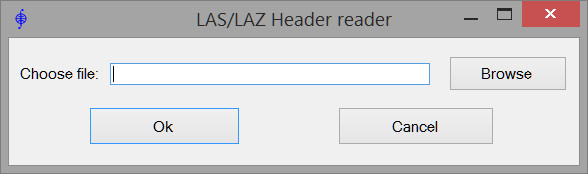

[**Back to application list**](../)

---

### Reading LAS/LAZ file header

The application extracts information contained in the LAS/LAZ file header. Supported versions of LAS standard: 1.0, 1.1, 1.2, 1.3, 1.4. Extracted header information can be saved in a text file.

	
---

[**Download the app**](https://github.com/DenisAntoshkin/Applications/releases/download/LasHeaderReader/LasHeaderReader.zip)

[**Back to application list**](../)