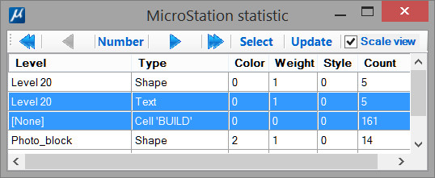
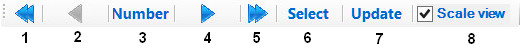

[**Back to application list**](../)

---

### Dgn file statistics (Bentley CONNECT Edition)

The application shows a list of graphic elements of the dgn file and allows user to select and iterate through them.

Elements are grouped by attributes:
*  Level
*  Type
*  Color
*  Line weight
*  Line style

Single click on a column header sorts the rows by that column.

Double click on a column header turns on/off corresponding attribute and rearranges elements in the table.

User can select one or more groups of elements (rows), using Shift and Ctrl if necessary.

1.  Go to first element
2.  Go to previous element
3.  Go to element with given number
4.  Go to next element
5.  Go to last element
6.  Select all specified elements
7.  Update statistics
8.  Flag for changing the view scale in accordance with the current element (if the flag is turned off, the view scale does not change)

Elements are displayed in the MicroStation view that is currently active. When displaying an element, the view is always set to Top mode. The depth of the view does not change (if the current element is not visible or partially visible, most likely its z-coordinates are outside the clipping planes of the corresponding MicroStation window)

The current element is highlighted. The element highlighting is automatically reset when you select any standard MicroStation tool or when you close the application window.

---

**Application usage:**

1.	Copy file 'stats.dll' to the folder …\MicroStation CONNECT Edition\MicroStation\Mdlapps\
2.	Enter key-in "mdl load stats" to run the application
3.	Select desired line(s) in the list and manage elements using toolbar at the top of the application window

To optimize the use of the utility, the following key-ins are provided:

*	"STATS FIRST" - Go to first element
*	"STATS LAST" - Go to last element
*	"STATS PREV" - Go to previous element
*	"STATS NEXT" - Go to next element
	
After closing the application window, you can reopen it with key-in command "stats"
	
---

[**Download the app**](https://github.com/DenisAntoshkin/Applications/releases/download/Stats/Stats.zip)

[**Back to application list**](../)