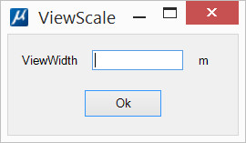

[**Back to application list**](../)

---

### MicroStation view scale (Bentley CONNECT Edition)

The application allows you to set the scale of the active MicroStation view by specifying the width of this window in working units (Master units).

---

**Application usage:**

1.	Copy file 'viewscale.dll' to the folder …\MicroStation CONNECT Edition\MicroStation\Mdlapps\
2.	Enter key-in "mdl load viewscale" to run the application
3.	Set desired width (in Master units) in the application dialog and click Ok

The scale setting affects the MicroStation view that is currently active.

After closing the application window, you can reopen it with key-in command "viewscale"
	
---

There is also a version of this application without an interface. Setting the scale in this version is done by key-in ‘VIEWSCALE SET <width>’, where <width> is the desired window width. Thus, setting scale can be done using a function button by assigning the command ‘mdl load viewscale; viewscale set <width>’.

[**Download the app with GUI**](https://github.com/DenisAntoshkin/Applications/releases/download/ViewScaleWithGui/ViewScaleWithGui.zip)

[**Download the app without GUI**](https://github.com/DenisAntoshkin/Applications/releases/download/ViewScaleWithoutGui/ViewScaleWithoutGui.zip)

[**Back to application list**](../)