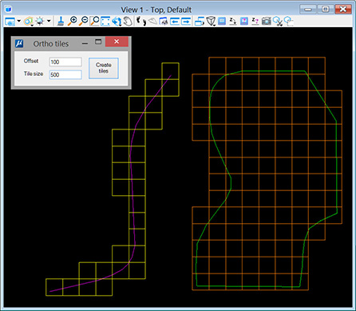

[**Back to application list**](../)

---

### Polygon generation (Bentley CONNECT Edition)

The application creates square orthogonal polygons that completely cover an area object or a corridor of a linear object. For an area object, the coverage area is defined by the object itself and the specified buffer. The coverage area of a linear object is defined by the centerline and width of the corridor. This tool can be useful to automatically create orthomosaic cutting blocks for linear and area objects.

The centerline of a line object can be an element of type Line (non-zero length), LineString, or Complex Chain. The area object must be of type Shape or Complex Shape.

*  **Offset** - a buffer relative to the original element that defines the coverage area. For a linear element, this parameter defines half the width of the corridor (on the left and right sides of the centerline)
*  **Tile size** - polygon side size

Before using the tool, the source element must be selected. Polygons are created in the active layer and with active dgn file attributes.

---

**Application usage:**

1.	Copy file 'orthotiles.dll' to the folder …\MicroStation CONNECT Edition\MicroStation\Mdlapps\
2.	Enter key-in "mdl load orthotiles" to run the application
3.	Set desired active attributes in the dgn file
4.	Select source area or line object
5.	Set desired parameters in the application dialog and click 'Create tiles' button

After closing the application window, you can reopen it with key-in command "orthotiles"

To use the application in another dgn file, you must restart MicroStation.
	
---

[**Download the app**](https://github.com/DenisAntoshkin/Applications/releases/download/OrthoTiles/OrthoTiles.zip)

[**Back to application list**](../)