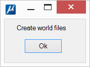

[**Back to application list**](../)

---

### Raster files georeferencing (Bentley CONNECT Edition)

The application creates [world files](https://en.wikipedia.org/wiki/World_file) for all rasters attached to dgn file in MicroStation Raster manager.

---

**Application usage:**

1.	Copy file 'rasterposition.dll' to the folder …\MicroStation CONNECT Edition\MicroStation\Mdlapps\
2.	Enter key-in "mdl load rasterposition" to run the application
3.	Click 'Ok' in the dialog

World files are created in the same folders in which the rasters are located. World file names correspond to raster names, extension = first + last raster extension character + 'w'. Those. tif -> tfw, jpg -> jgw, etc.

If world files already exist in the folder, they will be overwritten without warning. If there is no attached raster (such files are marked in red in the Raster manager window), it will be ignored.

After closing the application window, you can reopen it with key-in command "rasterposition"

---

[**Download the app**](https://github.com/DenisAntoshkin/Applications/releases/download/RasterPosition/RasterPosition.zip)

[**Back to application list**](../)