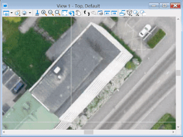

[**Back to application list**](../)

---

### Raster toggle (Bentley CONNECT Edition)

The application allows to sequentially display georeferenced rasters loaded into MicroStation Raster manager. For example, it can be used to speed up the digitization of base of buildings and other objects on top of orthorectified images for areas with high-rise buildings.

The application does not have an interface. Its functionality is run by key-ins:
*	‘RASTERTOGGLE ACTIVEVIEW’ – defines rasters inside the boundaries of the active MicroStation view
*	‘RASTERTOGGLE CHANGERASTER’ – sequentially displays rasters from the list defined by the first command in the active MicroStation view

For ease of use it is strongly recommended to bind key-in commands to MicroStation function keys.

---

**Application usage:**

1.	Copy file 'rastertoggle.dll' to the folder …\MicroStation CONNECT Edition\MicroStation\Mdlapps\
2.	Enter key-in "mdl load rastertoggle" to run the application
3.	Set desired scene in the active MicroStation view (use Top view setting)
4.	Enter “rastertoggle activeview” key-in (or press the corresponding MicroStation function key) to determine the rasters that fall into the active view
5.	Sequentally enter “rastertoggle changeraster" key-in (or press the corresponding MicroStation function key) to toggle rasters

To use the application in another dgn file, you must restart MicroStation.

---

[**Download the app**](https://github.com/DenisAntoshkin/Applications/releases/download/RasterToggle/rastertoggle.zip)

[**Back to application list**](../)