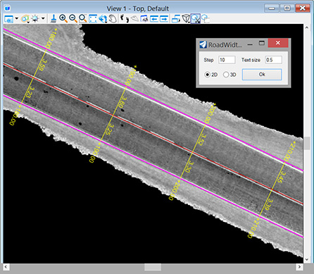

[**Back to application list**](../)

---

### Width measurement (Bentley CONNECT Edition)

The application measures the distances between two linear elements with a given step. As a result, lines, distance values and stationing labels are created in the dgn file. This tool was created to measure the width of a road.

The source elements must be of type Line (non-zero length), Line String, or Complex Chain. The result is created in the active layer and with the active attributes of the dgn file.

*	**Step** - stationing step
*	**Text size** - size of labels (in Master units)
*	**2d/3d** - distance measurement mode (for two-dimensional lines the result will be the same)

---

**Application usage:**

1.	Copy file 'roadwidth.dll' to the folder …\MicroStation CONNECT Edition\MicroStation\Mdlapps\
2.	Enter key-in "mdl load roadwidth" to run the application
3.	Set desired active attributes in the dgn file
4.	Set desired parameters in the application dialog and click 'Ok' button
5.	Specify the centerline with the first left mouse click, the edge of the road with the second left mouse click, and then confirm the entry with the third left mouse click anywhere in the view. Right mouse click cancels the last specified element

Distances are measured along lines perpendicular to the centerline (the first element specified)

After closing the application window, you can reopen it with key-in command "roadwidth"

To use the application in another dgn file, you must restart MicroStation.
	
---

[**Download the app**](https://github.com/DenisAntoshkin/Applications/releases/download/RoadWidth/RoadWidth.zip)

[**Back to application list**](../)