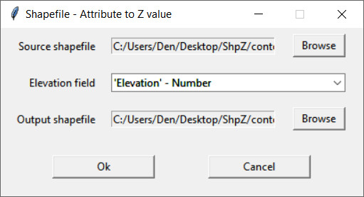

[**Back to application list**](../)

---

### Shapefile - Attribute to Z (Python)

The application reads source shapefile, converts value of defined attribute into Z-value and saves the result to a new shapefile. All geometry types are supported **except MULTIPATCH**. Measurement (M) values of the source shapefile are saved to the output file without changes.

This Python application was created using [pyshp](https://github.com/GeospatialPython/pyshp/tree/master) library and compiled into single executable file using [pyinstaller](https://github.com/pyinstaller). 

-	**Source shapefile** - the source shapefile
-	**Elevation field** - attribute to be converted into Z-value
-	**Output shapefile** - new shapefile in which the result is saved

---

**Application usage:**

Define source shapefile, field of the source file to be converted into Z-value, output shapefile and click Ok.

---

[**Download the app**](https://github.com/DenisAntoshkin/Applications/releases/download/ShpAttrToZ/ShpAttrToZ.zip)

[**Back to application list**](../)
