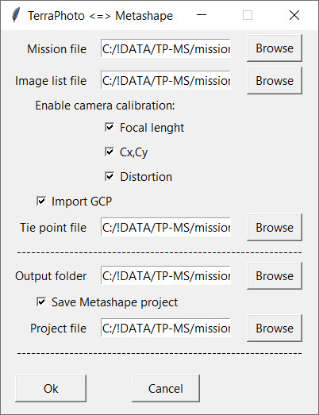

[**Back to application list**](../)

---

### TerraPhoto <-> Metashape (Python script)

The script imports [**TerraPhoto**](https://terrasolid.com/products/terraphoto/) project (mission, image list etc.), processes data and creates a new TerraPhoto project that can be loaded in TerraPhoto software for further processing.

The script has been tested for TerraPhoto 023.xxx and Metashape 2.1.0 

-	**Mission file** - source TerraPhoto mission file
-	**Image list file** - source TerraPhoto image list file
-	**Enable camera calibration** - options to calibrate camera(s) during Metashape aerial triangulation process
	- **_Focal length_** - enables to calculate focal length
	- **_Cx,Cy_** - enables to calculate principal point
	- **_Distortion_** - enables to calculate distortion parameters
-	**Import GCP** - enables to use control points measured in TerraPhoto in Metashape aerial triangulation process
-	**Tie point file** - source TerraPhoto tie point file where control points are saved
-	**Output folder** - folder where the script results will be saved
-	**Save Metashape project** - enables to automatically save Metashape project after the script completes
-	**Project file** - file to save Metashape project

---

**Application usage:**

1.	Run script 'tphoto-metashape,py' from opened Metashape instance
2.	Fill settings in the script dialog and click Ok
3.	After the script complete load mission and image list from **'Output folder'** in TerraPhoto software

---

**Script features:**
*	Supported raster formats for raw data are: JPEG, JPEG2000, TIF, PNG, BMP (not all of them are tested)
*	Only existing raster files are included in the output image list
*	If TerraPhoto camera has distortion model other than "Function", calibration of its distortion will always be applied
*	To use GCP measured in TerraPhoto, 'Image number' should be saved in the image list. Only "Known xyz" points are used

---

[**Download the app**](https://github.com/DenisAntoshkin/Applications/releases/download/TphotoMetashape/TphotoMetashape.zip)

[**Back to application list**](../)