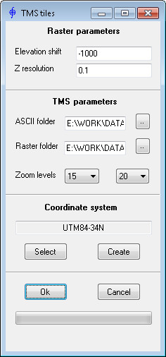
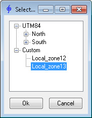
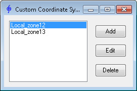
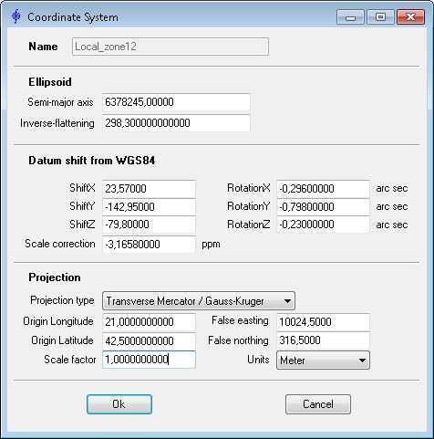

[**Back to application list**](../)

---

### Terrain-RGB-Mapbox tile generation

The application converts [ArcInfo ASCII Grid](https://en.wikipedia.org/wiki/Esri_grid) files into PNG (Terrain-RGB) raster tile structure that can be used in web mapping applications ([**Slippy Map**](https://wiki.openstreetmap.org/wiki/Slippy_map)). Tiles contain elevation information encoded into RGB values according to the rules adopted in the [**Mapbox**](https://www.mapbox.com/) project: [**Mapbox Global elevation data**](https://blog.mapbox.com/global-elevation-data-6689f1d0ba65)

Tile cutting and naming correspond to the [**Tile Map Service**](https://en.wikipedia.org/wiki/Tile_Map_Service) notation, i.e. folder name and raster name are taken from the coordinates of its lower left corner in the [**Web Mercator (EPSG:3857)**](https://spatialreference.org/ref/epsg/3857/) projection.

ArcInfo ASCII Grid files must have square cells and center of bottom-left cell as the origin. These ArcInfo ASCII Grid files can be created automatically from LIDAR data using **TerraScan**.

ASCII file header example:

|:-----------------------|
|_ncols 546_             |
|_nrows 790_             |
|_xllcenter 325484.750_  |
|_yllcenter 6818819.750_ |
|_cellsize 0.5000_       |
|_nodata_value -9999_    |

As a result, in the output folder data structure is created corresponding to the selected resolution levels (zoom) and the area covered by the ArcInfo ASCII Grid source files: **\zoom\x\y.png**

**_Raster parameters_**
*	**Elevation shift** - "zero height". Pixels corresponding to this height will have RGB values = (0, 0, 0)
*	**Z resolution** - accuracy of height values. It is taken into account	when encoding into color

**_TMS parameters_**
*	**ASCII folder** - folder containing ArcInfo ASCII Grid source files. Files must have the extension “xyz” - other files are ignored. If the file format with the extension “xyz” does not match the specification, this file will also be ignored during processing
*	**Raster folder** - target folder in which the result will be saved
*	**Zoom levels** - minimum and maximum levels of detail (resolution). Information about this parameter can be found [**here**](https://wiki.openstreetmap.org/wiki/Zoom_levels)

**_Coordinate system_**
*	**Select** - selecting coordinate system of the source ASCII files:

- The following coordinate systems of ASCII source files are supported:
  - UTM on WGS84 ellipsoid
  - custom CS based on the Gauss-Kruger projection
  
*	**Create** - creating and editing user-defined custom coordinate systems:

Parameters in the dialog to define custom coordinate system involve the 7-parameter Helmert transformation **Coordinate frame rotation** and **Datum shift from WGS84**. (When using the **Datum shift to WGS84** and/or **Position Vector Rotation** conversion options, the signs must be changed accordingly.) User-defined custom coordinate systems are saved in the xml-file located in the same folder as the application.

While the application is running, the progress bar at the bottom of the application window shows the progress, total number and number of tiles currently generated.

---

[**Download the app**](https://github.com/DenisAntoshkin/Applications/releases/download/TMSTiles/TMS-tiles.zip)

[**Back to application list**](../)