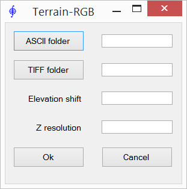

[**Back to application list**](../)

---

### Terrain-RGB-Mapbox raster generation

The application converts [ArcInfo ASCII Grid](https://en.wikipedia.org/wiki/Esri_grid) files into TIFF files (Terrain-RGB), which contain elevation information encoded into RGB values according to the rules adopted in the [**Mapbox**](https://www.mapbox.com/) project: [**Mapbox Global elevation data**](https://blog.mapbox.com/global-elevation-data-6689f1d0ba65)

The height value for each pixel in the image can be taken using the formula: **H = Elevation shift + (R * 256 * 256 + G * 256 + B) * Z resolution**

Raster georeferencing is saved in *.tfw world files, which are also generated in the output folder.

ArcInfo ASCII Grid files must have square cells and center of bottom-left cell as the origin. These ArcInfo ASCII Grid files can be created automatically from LIDAR data using **TerraScan**.

ASCII file header example:

|:-----------------------|
|_ncols 546_             |
|_nrows 790_             |
|_xllcenter 325484.750_  |
|_yllcenter 6818819.750_ |
|_cellsize 0.5000_       |
|_nodata_value -9999_    |

*	**ASCII folder** - folder containing ArcInfo ASCII Grid source files. Files must have the extension “xyz” - other files are ignored. If the file format with the extension “xyz” does not match the specification, this file will also be ignored during processing
*	**TIFF folder** - target folder in which the result will be saved (*.tif + *.tfw). The names of the output files will correspond to the names of the source ones. If the names match, the files in the output folder are overwritten without warning
*	**Elevation shift** - "zero height". Pixels corresponding to this height will have RGB values = (0, 0, 0)
*	**Z resolution** - accuracy of height values. It is taken into account	when encoding into color
	
---

[**Download the app**](https://github.com/DenisAntoshkin/Applications/releases/download/TerrainRgb/TerrainRgb.zip)

[**Back to application list**](../)