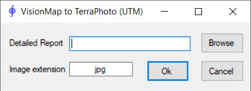

[**Back to application list**](../)

---

### VisionMap A3 -> TerraPhoto

The application converts VisionMap A3 camera data ('Detailed Report.txt') to TerraPhoto data (.iml, .cal). 'Detailed Report.txt' is generated by VisionMap software and contains internal camera parameters and exterior orientation of images. As a result of running the application, TerraPhoto camera files (.cal) and image list (.iml) are created in the folder where the source 'Detailed Report.txt' is located. Exterior orientation of images in the .iml file is calculated in appropriate WGS84 UTM zone.

	
---

[**Download the app**](https://github.com/DenisAntoshkin/Applications/releases/download/VmToTerraPhoto/VmToTerraPhoto.zip)

[**Back to application list**](../)